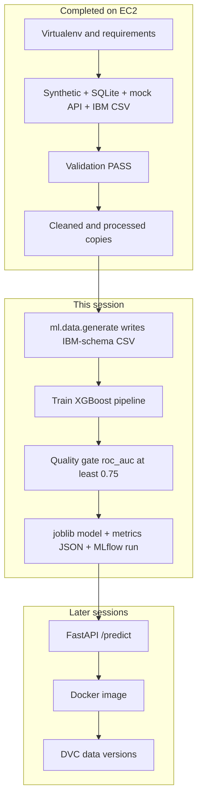
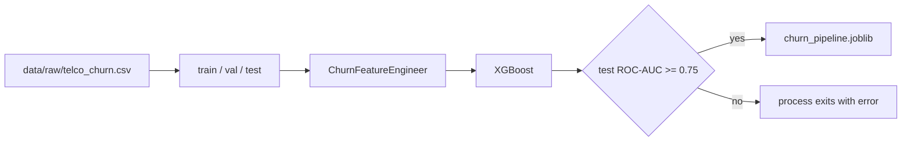

# MLOps lifecycle guide — customer churn

This guide is written for a DevOps engineer learning this repository one stage at a time.
Read it in order. Run only the commands in the section marked **Do this now**. Later stages are mapped so you know where the road goes; they are not homework for this session.

You are on the EC2 host as root, in:

```text
/root/customer_churn_predition
```

branch `dev`, virtualenv already created.

If you open a **new** SSH session, the virtualenv is not active until you turn it back on:

```bash
cd /root/customer_churn_predition
source .venv/bin/activate
```

The prompt should show `(.venv)`. Every Python command below assumes that.

---

## 1. What your logs already proved

Your session completed the **data foundation**. It did not train a model. That is expected. This phase of the repo collects, checks, and cleans data. Training is the next phase.

| Check | Result | What it means |
| --- | --- | --- |
| Ubuntu, Python 3.14.4, venv, `pip install -r requirements.txt` | Success | Isolated runtime is ready. Same idea as a build environment that does not use system packages. |
| Synthetic snapshots `2026-01`, `2026-02`, `2026-03` | Success | 2000 rows each, churn about 14–17%. Seed `42` makes the same numbers next time. |
| SQLite init + 5 table extracts | Success | Local stand-in for a CRM/billing database. Not a real PostgreSQL server. |
| Mock API, 20 pages, 2000 rows | Success | Local stand-in for a vendor HTTP API. It listened on `127.0.0.1`, then exited. |
| Validation of `data/synthetic/2026-01/customers.csv` | `PASS` | The file matches the `synthetic_operational` contract. |
| Preparation | Wrote interim + processed CSVs | Cleaning copied data forward. Raw files were not edited. |
| Public IBM CSV download | 7043 rows, sha256 recorded | Research sample landed in `data/raw/Telco-Customer-Churn.csv`. |
| `pytest -q` | **37 passed** | Acquisition, validation, preparation, API, and model-schema tests passed. |
| `git status` | Only untracked `data/sources/local_ops.sqlite.init.json` | Generated data is gitignored. Do not commit that JSON. |

`ls | wc -l` stayed at **16** after every data command. That number is the count of names in the repo root (`README.md`, `data/`, `api/`, …). New files were created **inside** `data/`, so the root count does not change. Confirm the data with:

```bash
find data -type f | sort
```

You should see synthetic CSVs, a SQLite file, database and API snapshots, a validation JSON, cleaned and processed CSVs, and the IBM CSV.

---

## 2. The whole lifecycle, and where you are

Think of this the way you think of a delivery pipeline. Data is the artifact. Validation is the gate. The model file is the build output. The API is the deployment.

```text
YOU ARE HERE
    │
    ▼
[0] Machine + virtualenv          DONE
[1] Acquire data                  DONE
[2] Validate (quality gate)       DONE
[3] Prepare (clean copies)        DONE
[4] Automated tests               DONE, with 1 known failure
        │
        ▼
[5] Build the MODEL dataset       ← do this now
[6] Train + score the model       ← do this now
[7] Read metrics and artifacts    ← do this now, then stop
        │
        ▼
[8] Serve predictions (API)       later session
[9] Package in Docker             later session
[10] Version data with DVC        later session
[11] Registry, K8s, drift, retrain  later, after 8–10 feel familiar
```



There are **two data paths** in this repo. Mixing them up is the main thing that makes the next step feel confusing.

| Path | What you already ran | File it writes | Used to train XGBoost? |
| --- | --- | --- | --- |
| Data foundation | `data_acquisition.*`, `data_validation`, `data_preparation` | `data/synthetic/…`, `data/raw/database/…`, `data/raw/api/…`, `data/raw/Telco-Customer-Churn.csv` | No. Different layout and purpose. |
| Model path | Not run yet | `data/raw/telco_churn.csv` from `python3 -m ml.data.generate` | Yes. This is the table the trainer reads. |

The IBM download (`Telco-Customer-Churn.csv`, capital letters) is a public research file. The trainer reads `data/raw/telco_churn.csv` (lowercase). Those are different files on purpose. Training does not silently pick up the IBM file or the synthetic operational snapshots.

---

## 3. Stages you already finished — why each command existed

### Stage 0 — Runtime

```bash
sudo apt update
sudo apt install -y python3 python3-venv python3-pip
python3 -m venv .venv
source .venv/bin/activate
pip install -U pip
pip install -r requirements.txt
```

| Command | What it does | Why it is required |
| --- | --- | --- |
| `apt update` | Refreshes the Ubuntu package index. | Install would use a stale list. Your banner even warned the list was old. |
| `apt install python3 python3-venv python3-pip` | Ensures Python, the venv module, and pip exist. | Ubuntu 26.04 already had Python 3.14. `venv` was the missing piece that creates isolated environments. |
| `python3 -m venv .venv` | Creates `.venv/` with its own interpreter and `site-packages`. | Project libraries (pandas, XGBoost, FastAPI) stay inside the repo. System Python stays clean. Same idea as not installing app packages into the host OS. |
| `source .venv/bin/activate` | Puts `.venv/bin` first on `PATH`. | `python3` and `pip` then mean the venv, not `/usr/bin`. |
| `pip install -U pip` | Upgrades the installer inside the venv. | Newer pip resolves the pins in `requirements.txt` more reliably. |
| `pip install -r requirements.txt` | Installs the locked project stack: pandas, scikit-learn, XGBoost, FastAPI, MLflow, pytest, and their dependencies. | Training and tests import these modules. Without this step, every later command fails on `ModuleNotFoundError`. |

`.venv/` is gitignored. You recreate it on each machine. You do not commit it.

### Stage 1 — Acquire

In a company, MLOps usually does not own the CRM, the billing database, or the vendor API. This repo **simulates those four boundaries** so you can practice the hand-off.

```text
dataset_catalog.yaml  (allow-list: which public URLs are legal to fetch)
        │
        ├── public CSV          → data/raw/Telco-Customer-Churn.csv
        ├── SQLite simulation   → data/raw/database/<timestamp>/*.csv
        ├── mock HTTP API       → data/raw/api/<timestamp>/*.json
        └── synthetic generator → data/synthetic/YYYY-MM/customers.csv
```

```bash
python3 -m data_acquisition.synthetic_source --number-of-records 2000 --random-seed 42
python3 -m data_acquisition.database_init
python3 -m data_acquisition.database_source
python3 -m data_acquisition.api_source
python3 -m data_acquisition.download
```

| Command | What it does | Why it is required |
| --- | --- | --- |
| `synthetic_source` | Writes three monthly fake operational snapshots. `--random-seed 42` fixes the random draws. | Gives you labeled data you can regenerate. A seed is the data version of a pinned dependency: same input, same output. |
| `database_init` | Creates `data/sources/local_ops.sqlite` and inserts 500 customers plus related billing/usage rows. | Stands in for “DBA gave us a replica.” The log line `LOCAL SIMULATION` means this is not production Postgres. |
| `database_source` | `SELECT`s each table and writes a timestamped snapshot under `data/raw/database/`. | Raw extracts are immutable copies. Training never queries the live database. If the DB changes tomorrow, yesterday’s snapshot still exists. |
| `api_source` | Starts a fake HTTP server on localhost, pages through `/v1/customers`, stores JSON pages, then shuts the server down. | Same pattern as a vendor API: paginate, store the raw payload first, derive a table later. The `httpx` 200 lines are the client calling that fake server. |
| `download` | HTTPS GET of the IBM telco CSV from the URL allowed in `data/sources/dataset_catalog.yaml`. Records SHA-256. | Public data is allow-listed. The checksum is how you prove the file was not truncated or swapped. Your log shows `sha256=16320c9c…` and `rows=7043`. |

Raw bytes are not edited after this. That rule is the same as an immutable artifact repository: you publish a new version, you do not overwrite the old blob.

`data/sources/local_ops.sqlite.init.json` showed up as untracked. It is run metadata. Leave it untracked. The `.sqlite` file itself is gitignored.

### Stage 2 — Validate

```bash
python3 -m data_validation.validate \
  --input data/synthetic/2026-01/customers.csv \
  --schema synthetic_operational \
  --strict
```

| Piece | Meaning |
| --- | --- |
| `--input` | Which file to judge. Validation does not modify it. |
| `--schema synthetic_operational` | Which contract to use. The IBM file would use a different schema name. A contract is a schema the way an OpenAPI spec is a contract: column names, allowed values, ranges. |
| `--strict` | Warnings become failures. In CI this is the difference between “yellow” and “red build.” |
| `PASS` plus a JSON report | Machine-readable gate. A scheduler can fail the job from the exit code and the report path. |

Your report path:

```text
data/interim/validation_reports/customers_validation.json
```

Why this exists: a training job that silently trains on a broken extract wastes the whole pipeline. The check runs **before** preparation and **before** training. Bad data stops the line.

### Stage 3 — Prepare

```bash
python3 -m data_preparation.prepare \
  --input data/synthetic/2026-01/customers.csv
```

This copies data forward:

```text
raw or synthetic file
    → data/interim/customers.cleaned.csv      (trim, duplicates, empty tokens)
    → data/processed/customers.processed.csv  (types, analysis-ready)
    → data/processed/customers.processed.lineage.json
```

It does **not** one-hot encode columns or train a model. Cleaning is a data-engineering step. Feature engineering is an ML step and happens later, inside the model pipeline, so the API uses the same transforms as training.

Your log:

```text
interim=/root/customer_churn_predition/data/interim/customers.cleaned.csv
processed=/root/customer_churn_predition/data/processed/customers.processed.csv
```

### Stage 4 — Tests

```bash
pytest -q
```

Pytest is the CI check (the same suite `.github/workflows/ci.yml` runs). **37 passed** means acquisition, validation, preparation, API, and model-schema tests are healthy on this machine.

If you still see `test_generated_data_matches_contract` fail with `'gender' != 'tenure'`, pull the latest `dev` and rerun `pytest -q`. That failure was the generator emitting IBM spreadsheet order (`gender` in column 2) while `REQUIRED_COLUMNS` puts `tenure` there. `generate_churn_dataset()` now reorders to the contract before it returns.

---

## 4. Schema contract

`tests/test_schema.py` builds a small table with `generate_churn_dataset()` and requires the **column order** to equal `REQUIRED_COLUMNS`: customer id, then numeric fields (`tenure`, `MonthlyCharges`, `TotalCharges`), then categoricals, then `Churn`.

`validate_dataframe()` checks names, allowed values, and consistency. The unit test also checks order. Training still selects columns **by name** (`FEATURE_COLUMNS`), so a CSV saved in IBM order can still train. The generator itself now writes contract order so the test and the saved synthetic file agree.

---

## 5. Do this now — model dataset, train, read the result

Stay in the same shell, venv on, repo root.

### 5.1 Why this stage exists

The data foundation proved you can land and check data. The model stage answers a different question:

> Given this customer’s contract, services, and bill, how likely are they to leave?

The trainer needs one table with the IBM-style columns and a `Churn` label of `Yes` or `No`. `ml.data.generate` builds that table offline (5000 rows, seed from `configs/config.yaml`). In a company this command would be “export the warehouse table.” Here it is the stand-in, so the rest of the pipeline can run without a warehouse.

### 5.2 Generate the training table

```bash
python3 -m ml.data.generate
```

What it does:

1. Reads `configs/config.yaml` (`n_samples: 5000`, `random_state: 42`, output path `data/raw/telco_churn.csv`).
2. Builds rows with realistic drivers: month-to-month contract, fiber, electronic check, short tenure, and missing tech support raise churn probability. Labels are not random coin flips.
3. Checks the frame against the schema.
4. Writes the CSV. Prints row count and churn rate.

Why it is required: `ml.training.train` looks for `data/raw/telco_churn.csv`. If the file is missing, training generates it anyway. Run generate yourself so you see the dataset **before** the model exists. That is the same habit as inspecting an artifact before you deploy it.

Confirm:

```bash
python3 - <<'PY'
import pandas as pd
df = pd.read_csv("data/raw/telco_churn.csv")
print("rows", len(df))
print("columns", list(df.columns))
print(df["Churn"].value_counts())
print(df.head(3).to_string(index=False))
PY
```

You want about 5000 rows, a `Churn` column of Yes/No, and a churn rate roughly between 20% and 40%. Exact rate depends on the seed; it should be stable if you regenerate with the same config.

### 5.3 Train

```bash
python3 -m ml.training.train
```

What happens inside `ml/training/train.py`, in order:

```text
telco_churn.csv
    │
    ▼
load + schema check          names and allowed values
    │
    ▼
split                    70% train / 10% validation / 20% test
    │                    (test_size 0.20, val_size 0.10 in configs/config.yaml)
    ▼
feature pipeline         ChurnFeatureEngineer + one-hot encoder
    │                    fitted only on the training rows
    ▼
XGBoost classifier       trees on those encoded columns
    │
    ▼
score validation + test  ROC-AUC, PR-AUC, precision, recall, F1, confusion counts
    │
    ▼
quality gate             fail the process if test ROC-AUC < 0.75
    │
    ▼
write artifacts + MLflow
```



DevOps translation:

| ML word | Closest thing you already know |
| --- | --- |
| Train split | The build. The model is allowed to learn from these rows only. |
| Validation split | A staging check used while you compare settings. This trainer fits once, then reports validation metrics. It does not loop and pick a winner. |
| Test split | The release gate. These rows were not used to fit the model. |
| `ChurnFeatureEngineer` | A transform step baked into the artifact, like a Dockerfile `RUN` that must be identical in prod. The API loads the same pipeline, so serving cannot drift from training. |
| One-hot encoding | Turns `Contract=Month-to-month` into numeric columns a tree model can split on. |
| `scale_pos_weight` | Churners are the minority. The trainer up-weights them so the model does not “win” by always predicting “stay.” |
| Quality gate `roc_auc >= 0.75` | A pipeline assertion. Below the bar, training raises and does not treat the run as good. Same role as a failing test in CI. |
| `churn_pipeline.joblib` | The deployable artifact: features + model in one file. |
| MLflow `mlruns/` | Build logs: parameters, metrics, and a copy of the model. Local folder, not a remote server. |

Hyperparameters live in `configs/config.yaml` under `model.params` (250 trees, depth 4, learning rate 0.05, and so on). You are not tuning them in this session. You are producing one known-good run.

Expect the command to print a JSON blob with `validation` and `test`, then a line like:

```text
Saved pipeline to .../artifacts/models/churn_pipeline.joblib
```

If you see `Quality gate failed`, stop and paste that JSON. Do not start the API.

### 5.4 Read the artifacts, then stop

```bash
python3 - <<'PY'
import json
from pathlib import Path
metrics = json.loads(Path("artifacts/metrics/metrics.json").read_text())
meta = json.loads(Path("artifacts/models/metadata.json").read_text())
importance = json.loads(Path("artifacts/metrics/feature_importance.json").read_text())
test = metrics["test"]
print("trained_at", meta["trained_at"])
print("rows train/val/test", meta["n_train"], meta["n_val"], meta["n_test"])
print("threshold", meta["threshold"])
print("test roc_auc", round(test["roc_auc"], 4))
print("test pr_auc ", round(test["pr_auc"], 4))
print("test precision", round(test["precision"], 4))
print("test recall   ", round(test["recall"], 4))
print("test f1       ", round(test["f1"], 4))
print("TP FP FN TN", test["true_positives"], test["false_positives"], test["false_negatives"], test["true_negatives"])
print("--- top features ---")
for name, score in list(importance.items())[:8]:
    print(f"{score:.4f}  {name}")
PY
```

How to read the numbers, slowly:

| Metric | Plain meaning | What “good” means on this project |
| --- | --- | --- |
| ROC-AUC | If you pick one random churner and one random stayer, how often does the model score the churner higher? 0.5 is a coin flip. 1.0 is perfect. | Quality gate requires **at least 0.75** on the test set. |
| PR-AUC | Same idea, but focused on the rare positive class (churn). More honest than accuracy when most customers stay. | Higher is better. There is no second gate number in code. |
| Precision | Of the customers you flagged as churn, how many actually churn. | Low precision means wasted retention offers. |
| Recall | Of the customers who actually churn, how many you flagged. | Low recall means churners slip through. |
| F1 | Balance of precision and recall. | Useful single number; the gate itself uses ROC-AUC. |
| Threshold `0.50` | Probability at or above 0.50 becomes prediction `1` (will churn). | This is a business knob, not a math law. Moving it trades precision against recall. Do not change it yet. |
| TP / FP / FN / TN | True churn caught, false alarms, missed churners, correctly left alone. | FN is a missed save. FP is a discount given to someone who would have stayed. |

Feature importance is a ranked list of encoded columns the trees used. Names look like `cat__Contract_Month-to-month` because the one-hot encoder prefixed them. High rank means “the model split on this a lot.” It is an explanation aid, not a proof of cause.

MLflow writes a local experiment under `mlruns/`. Newer MLflow releases block that directory store unless `MLFLOW_ALLOW_FILE_STORE=true`. The trainer sets that itself before it opens the experiment, so you do not export it by hand. You do not need the MLflow UI for this session. The JSON files above are the source of truth you can read in the terminal.

`git status` will show new untracked or ignored paths under `data/raw/telco_churn.csv`, `artifacts/`, and `mlruns/`. Those are generated outputs. Do not commit them.

**Stop here.** The next session starts the API against the file you just trained. Skipping the read-back is how people deploy a model they have not looked at.

---

## 6. Later sessions — map only, do not run yet

### Session B — Serving

Why it exists: a notebook score does not help a retention system. The API loads `artifacts/models/churn_pipeline.joblib` and applies the same feature pipeline.

```bash
uvicorn api.main:app --host 0.0.0.0 --port 8000
```

Then `POST /predict` with one customer JSON (example in `README.md`). Response fields: `churn_probability`, `churn_prediction`, `risk_band`.

On EC2, port 8000 must be allowed in the security group if you call it from your laptop. `curl` on the instance to `http://127.0.0.1:8000/docs` does not need that rule.

`--reload` is for laptop development. On this server, omit `--reload`.

### Session C — Container

Why it exists: the venv on one VM is not a repeatable deploy. `mlops/docker-compose.yml` builds an image that contains the app and the trained artifact.

Train first. The image expects `artifacts/models/churn_pipeline.joblib` to exist.

```bash
docker compose -f mlops/docker-compose.yml up --build
```

Docker is not installed on the host yet. That install is part of session C, not this one.

### Session D — Data versioning with DVC

Why it exists: Git versions code. DVC versions large files and records which data produced which metrics. `dvc.yaml` already describes two stages:

```text
collect:  python -m ml.data.generate   →  data/raw/telco_churn.csv
train:    python -m ml.training.train  →  joblib + metrics
```

`dvc repro` would rerun a stage only when its code, params, or inputs change. That is the ML version of “don’t rebuild if the inputs are cached.” Wiring a remote (S3) comes after a local `dvc repro` makes sense to you.

### After that

| Stage | Role | Not in this session because |
| --- | --- | --- |
| MLflow model registry | Promote a run from Staging to Production | Local `mlruns/` already records the run. A registry server is a separate service. |
| Threshold tuning | Change `0.50` using a cost for false alarms vs missed churn | You need one baseline run first, which is section 5. |
| SHAP plots | Per-customer explanation | Needs the frozen pipeline from section 5. |
| Kubernetes | Run the container on a cluster | Docker image comes first. |
| Drift and retrain | Compare live inputs to training data and trigger a new train | Needs serving traffic. There is no live traffic yet. |

---

## 7. Commands cheat sheet

Completed (do not repeat unless you are rebuilding the machine):

```bash
source .venv/bin/activate
python3 -m data_acquisition.synthetic_source --number-of-records 2000 --random-seed 42
python3 -m data_acquisition.database_init
python3 -m data_acquisition.database_source
python3 -m data_acquisition.api_source
python3 -m data_validation.validate \
  --input data/synthetic/2026-01/customers.csv \
  --schema synthetic_operational \
  --strict
python3 -m data_preparation.prepare \
  --input data/synthetic/2026-01/customers.csv
python3 -m data_acquisition.download
pytest -q
```

This session:

```bash
cd /root/customer_churn_predition
source .venv/bin/activate
python3 -m ml.data.generate
python3 -m ml.training.train
```

Then run the artifact reader in section 5.4 and stop.
